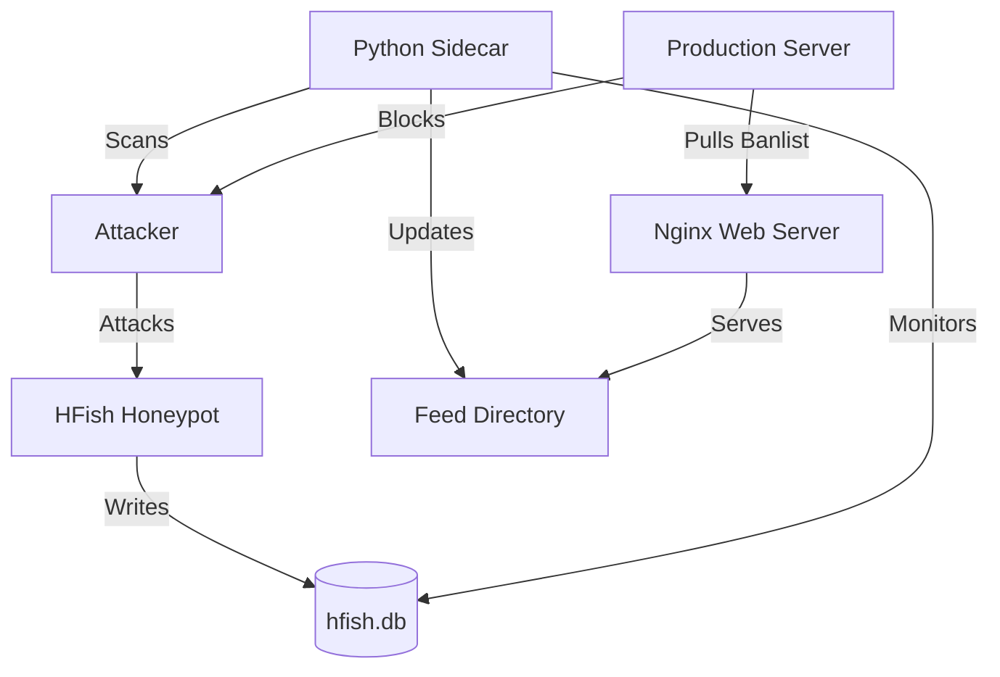

# HFish - High Fidelity Honeypot Platform

hfISH is a community-driven free honeypot product, focusing on enterprise security scenarios. Starting from three scenarios: intranet intrusion detection, external threat perception, and threat intelligence production, it provides users with independently operable and practical functions. Through safe, agile, and reliable low-to-medium interaction honeypots, it increases users' capabilities in intrusion perception and threat intelligence.

## Contact Us

HFish is a community-based free honeypot product under Beijing Weibu Online Technology Co., Ltd.


HFish supports over 90 types of honeypot services including basic network services, OA systems, CRM systems, NAS storage systems, Web servers, operation and maintenance platforms, security products, wireless APs, switches/routers, mail systems, IoT devices, etc. It supports users in creating custom Web honeypots, traffic diversion to free cloud honeynets, toggleable full-port scanning perception capabilities, customizable bait configurations, one-click deployment, cross-platform multi-architecture support (Linux x32/x64/ARM, Windows x32/x64 platforms and various domestic operating systems), and supports domestic CPUs like Loongson, Hygon, Phytium, Kunpeng, Tengyun, Zhaoxin, etc. It has extremely low performance requirements and features multiple alerting methods like Email/Syslog/Webhook/WeCom/DingTalk/Lark, helping users reduce operation and maintenance costs and improve operational efficiency.

Users need to deploy the management end first, and then deploy built-in honeypot nodes or new nodes through the management end:

*   [Linux AMD64 Management End Download](https://hfish.net/#/2-2-linux)
*   [Linux ARM64 Management End Download](https://hfish.net/#/2-2-linux)
*   [Windows Management End Download](https://hfish.net/#/2-3-windows)
*   [Docker Image Download](https://hfish.net/#/2-1-docker)

If there are enterprise download needs, you can also go to the [HFish Documentation Area](https://hfish.net/#/docs) to download deployment document plans.

## Why Choose HFish

### Free, Simple, and Safe Honeypot Product
Honeypots are usually defined as detection products with lightweight detection capabilities and low false positive rates. At the same time, they are also one of the high-quality sources for enterprises to produce local threat intelligence. HFish can help small and medium-sized enterprise users avoid alert floods and increase threat perception and intelligence production capabilities at low cost in daily security operations. Currently, the strength of the community is constantly helping HFish improve itself and jointly explore the best practices of deception defense.

### Safe and Agile Threat Perception Nodes
HFish is widely used effectively to perceive lateral movement of compromised hosts in office intranets, production environments, cloud intranets, and other environments, employee account leaks, scanning and probing behaviors, private intelligence production, and even internal drills and security awareness training. HFish's various alert output forms combined with situation awareness, NDR, XDR, or log platforms greatly expand the detection field of view.

## HFish Architecture

HFish adopts a B/S architecture, composed of a management end (server) and a node end (client). The management end is used to generate and manage node ends, and receive, analyze, and display data returned by node ends. The node end accepts control from the management end and is responsible for building honeypot services.

In HFish, the **Management End** is only used for **data analysis and display**, the **Node End** performs **virtual honeypot** functions, and finally the **Honeypot bears the attack**.

---

# Active Defense Extension (Honey-Scan)

This repository includes a custom "Active Defense" ecosystem built on top of HFish. It automates the process of identifying attackers and blocking them while gathering intelligence.

## Features

*   **Automated Reconnaissance**: A Python 'sidecar' container monitors the HFish database. When a new attacker IP is detected, it automatically runs an `nmap -A -T4` scan against them.
*   **Intelligence Feed**: An Nginx container serves a live feed of blocked IPs (`banned_ips.txt`) and hosts the full Nmap scan reports.
*   **Active Blocking**: A client-side script (`scripts/client_banned_ips.sh`) can be deployed on your production servers to fetch the ban list and automatically drop traffic from attackers.

## Architecture Diagram



## Installation & Usage

1.  **Clone the Repository**:
    ```bash
    git clone https://github.com/derlemue/honey-scan.git
    cd honey-scan
    ```

2.  **Start the Ecosystem**:
    ```bash
    docker-compose up -d --build
    ```
    This launches:
    *   Honeypot Server (Ports 4433, 2222, etc.)
    *   Sidecar Scanner
    *   Feed Server (Port 8888)

3.  **Access the Dashboard**:
    *   Open `http://localhost:8888` to view the Active Defense Dashboard (Scan reports and Ban list).
    *   Open `https://localhost:4433` for the HFish Administration Console.

4.  **Deploy Protection (Client Side)**:
    On your other servers (the ones you want to protect), download and run the client script:
    ```bash
    wget http://<HONEYPOT_IP>:8888/scripts/client_banned_ips.sh
    chmod +x client_banned_ips.sh
    # Edit the script to set your HONEYPOT_IP
    ./client_banned_ips.sh
    ```

## Customization

The active defense logic is located in `sidecar/monitor.py`. You can modify the scan parameters or the logic for adding IPs to the ban list (e.g., whitelist certain ranges).
