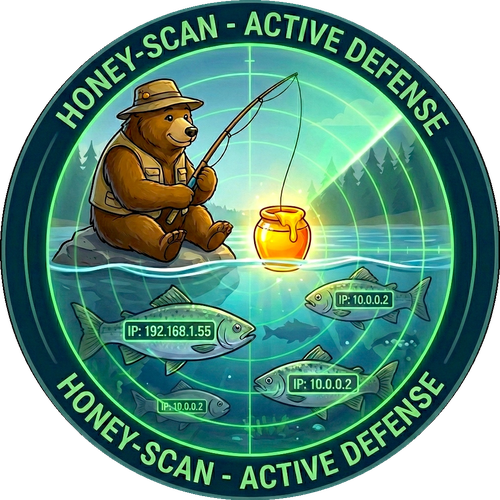
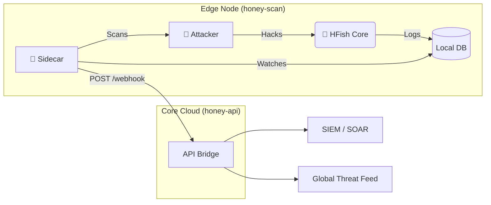
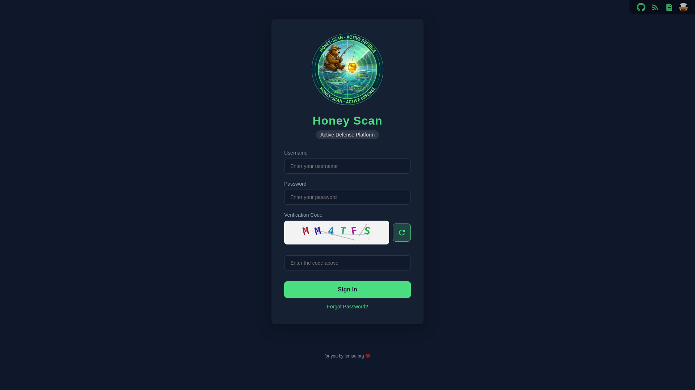

<div align="center">
    
    <h1>Honey Scan</h1>
    <h3>The Sensor of the Honey-Ecosystem</h3>

[](https://github.com/derlemue/honey-scan)
[](https://github.com/derlemue/honey-scan)
[](https://github.com/derlemue/honey-scan)
[](https://github.com/hacklcx/HFish)
[](https://www.docker.com/)
[](https://www.python.org/)
[](https://www.gnu.org/software/bash/)
[](https://nginx.org)
[](https://mariadb.org)
<br>
[](https://github.com/derlemue/honey-scan)
[](https://github.com/derlemue/honey-scan)
[](https://github.com/derlemue/honey-scan)

<p align="center">
  <a href="https://github.com/osint-inc" title="Ph0x"></a>
  <a href="https://github.com/derlemue" title="derlemue"></a>
  <a href="https://github.com/m3l1nda" title="m3l"></a>
  <a href="https://github.com/Cipher-Pup" title="Cipher-Pup"></a>
</p>

*Turn your honeypot into an active defense system that bites back.*

🇬🇧 [English](README.md) • 🇩🇪 [Deutsch](README_DE.md) • 🇩🇪 [Einfache Sprache](README_DE2.md) • 🇺🇦 [Українська](README_UA.md)

</div>

---

## 🌐 The Honey Ecosystem

This repository (`honey-scan`) is the **SENSOR** component of the Honey Ecosystem. It works in tandem with [**honey-api**](https://github.com/lemueIO/honey-api) (the **AGGREGATOR**).

### System Architecture

The ecosystem relies on a distributed sensor network:
1.  **Honey-Scan (Sensor)**: Deployed on the edge. Detects attacks, performs active reconnaissance (Nmap), and pushes raw intelligence to the API.
2.  **Honey-API (Bridge)**: Centralizes data from multiple sensors, normalizes it into ThreatBook v3 format, and feeds SIEM/SOAR systems.


```mermaid
graph LR
    subgraph "Edge Node (honey-scan)"
        A[👹 Attacker] -- Hacks --> B(🍯 HFish Core)
        B -- Logs --> C[(Local DB)]
        D[🐍 Sidecar] -- Watches --> C
        D -- Scans --> A
    end
    
    subgraph "Core Cloud (honey-api)"
        E[API Bridge]
    end

    D -- "POST /webhook" --> E
    E --> F[SIEM / SOAR]
    E --> G[Global Threat Feed]
```

### 🧠 Data Flow & API Contract (Deep Dive)

When `honey-scan` detects a new attacker, the **Sidecar** (`monitor.py`) asynchronously triggers a webhook to `honey-api`.

#### 1. The Trigger
*   **Source**: `honey-scan/sidecar/monitor.py`
*   **Method**: `POST`
*   **Destination**: Defined by `THREAT_BRIDGE_WEBHOOK_URL` (see Integration below).

#### 2. The Payload
The sensor sends a lightweight JSON payload containing the detected IP. The API is responsible for further enrichment (Reputation, Geo, etc.).

```json
{
  "attack_ip": "192.0.2.1"
}
```

#### 3. The Endpoint
The partner project `honey-api` listens on:
*   **Endpoint**: `/webhook`
*   **Method**: `POST`
*   **Response**: `200 OK` (Acknowledged)

---

## 🔌 Integration Guide

To link this **Sensor** (`honey-scan`) with the **API** (`honey-api`):

1.  **Deploy Honey-API**: Ensure the partner project is running (e.g., at `https://api.yourdomain.com`).
2.  **Configure Honey-Scan**:
    Edit your `.env.apikeys` file in the `honey-scan` root directory.
    
    ```bash
    # .env.apikeys
    
    # URL to your Honey-API instance webhook endpoint
    THREAT_BRIDGE_WEBHOOK_URL=https://api.yourdomain.com/webhook
    ```
3.  **Restart Sidecar**:
    ```bash
    docker compose restart sidecar
    ```
    
The sidecar will now automatically push every detected attacker IP to your central API.

---

> [!WARNING]
> **⚠️ DISCLAIMER: HIGH RISK TOOL ⚠️**
>
> This tool performs **ACTIVE RECONNAISSANCE** (Nmap scans) against IP addresses that connect to your honeypot.
> *   **Legal Risk**: Scanning systems without permission may be illegal in your jurisdiction.
> *   **Retaliation**: Aggressively scanning attackers may provoke stronger attacks (DDoS) or expose your infrastructure.
> *   **Usage**: Use strictly for educational purposes or within controlled environments where you accept all liability. **The authors are not responsible for any misuse or legal consequences.**

---

## 🔴 Live Preview (Early Beta)

Try the system live!

### Dashboard (Early Beta)
*   **URL**: [https://sec.lemue.org/web/login](https://sec.lemue.org/web/login)
*   **User**: `beta_view`
*   **Pass**: `O7u1uN98H65Lcna6TV`

### Feed (Live)
*   **URL**: [https://feed.sec.lemue.org/](https://feed.sec.lemue.org/)

---

## 📖 Overview

**Honey-Scan** transforms a passive HFish honeypot into an **Active Defense System**. Instead of just logging attacks, it bites back (informatively).

When an attacker touches your honeypot, Honey-Scan automatically:
1.  **🕵️ Detects** the intrusion via the HFish database.
2.  **🔍 Scans** the attacker immediately using `nmap`.
3.  **📢 Publishes** the intelligence to a local feed.
4.  **🛡️ Blocks** the attacker on your production infrastructure (via client scripts).

---

## 🚀 Key Features

*   **⚡ Real-Time Reaction**: Python sidecar monitors `hfish.db` and triggers scans within seconds of an attack.
*   **🌍 Smart Geolocation**: Automatically resolves attacker location (Country, City, Lat/Lng) and embeds it in reports.
*   **🧠 Intelligent Scanning**: Optimized logic prevents redundant scans and efficiently manages "Fail2Ban" and "Honey Cloud" placeholders.
*   **🛡️ Strict Zero-Action Policy**: Hardened whitelist logic for internal ports (2222, 4435, 8888). Traffic to these ports is now completely ignored (no Nmap, no Geo, no bans) to prevent false positives from admin tools or bait ports.
*   **📊 Automated Intel**: Generates detailed `.txt` reports for every unique attacker IP.
*   **🚫 Network Shield**: Serves a dynamic `banned_ips.txt` list that your other servers can consume to preemptively block threats.
*   **🖥️ Dashboard**: Simple web interface to browse scan reports and ban lists. Sorted by newest threats first.
*   **🖼️ Visuals**:
    *   **Login Interface**:
        <br>
        <div align="center">
        
        <p><em>Login Interface</em></p>
        </div>
    *   **Live Threat Feed**:
        <br>
        <div align="center">
        
        <p><em>Feed Dashboard</em></p>
        </div>
    *   **lemueIO SecMonitor ("Screen")**:
        <br>
        <div align="center">
        
        <p><em>Attack Map Dashboard</em></p>
        </div>
    *   **lemueIO Statistics** (Internal):
        <br>
        <div align="center">
        
        <p><em>Statistics Dashboard</em></p>
        </div>

---

## 🎥 Media Intelligence

Access our exclusive audio reports and video evidence vaults directly:

*   **🎧 [Audio Intelligence Portal](docs/audio-player.html)**: Listen to deep research reports and analysis essays.
*   **🎬 [Video Evidence Vault](docs/video-vault.html)**: View recorded attack sessions and system demonstrations.

---

## 🛠️ Installation


### 0. Automated Host Setup (Debian 13)
We provide a setup script that:
1.  Installs **Docker** & **Git**.
2.  Hardens SSH by moving it to Port **2222** (to free up Port 22 for the Honeypot).
3.  Reboots the system.

```bash
# Download and run as root
wget https://raw.githubusercontent.com/derlemue/honey-scan/main/scripts/setup_host.sh
chmod +x setup_host.sh
sudo ./setup_host.sh
```

> [!CAUTION]
> **SSH WARNING**: After the script finishes, your SSH port will change to **2222**.
> Ensure you connect with `ssh user@host -p 2222` and allow this port in your firewall!

### 1. Start the Server
clone the repo and launch the stack:

```bash
git clone https://github.com/derlemue/honey-scan.git
cd honey-scan

# 1. Create Environment Configuration
cp .env.example .env
# Edit .env and set your database passwords!

# 2. Create API Keys Configuration
cp .env.apikeys.example .env.apikeys
# Edit .env.apikeys if you need specific webhook URLs or Keys

# 3. Create HFish Configuration
cp config/hfish.toml.example config/hfish.toml
# Edit config/hfish.toml to match your database settings from .env

# 4. Launch
docker compose up -d --build
```

### 2. Access Dashboards
*   **lemueIO Active Intelligence Feed**: `http://localhost:8888`
*   **HFish Admin**: `https://localhost:4433` (Default: `admin` / `HFish2021`)

### 3. Deploy Client Shield (Fail2Ban Integration)
Protect your *other* servers by automatically banning IPs detected by this honeypot.
**Features**:
*   **Fail2Ban Integration**: Automatically creates/configures jails and actions.
*   **Persistence**: Refreshes jails to ensure bans persist across restarts.
*   **Whitelist Safety**: Respects your existing `ignoreip` settings.
*   **Auto-Update**: Self-updating capability to keep logic fresh.

Requires **Fail2Ban**. The script will offer to install it if missing.

Run this on your production servers:
```bash
# Download Script
wget https://feed.sec.lemue.org/scripts/banned_ips.sh

# Make executable
chmod +x banned_ips.sh

# Run (Requires Root for Fail2Ban interaction)
sudo ./banned_ips.sh
```

#### 🔄 Option B: Active Reporting (Fail2Ban Action)
Want your client servers to **report attacks back** to the mothership?

1.  **Install the Client Script**:
    ```bash
    sudo wget https://feed.sec.lemue.org/scripts/hfish-client.sh -O /usr/local/bin/hfish-client.sh
    sudo chmod +x /usr/local/bin/hfish-client.sh
    ```

2.  **Configure Fail2Ban Action**:
    Add this to your `jail.local` or action config:
    ```ini
    actionban = /usr/local/bin/hfish-client.sh <ip>
    ```

3.  **Configure API Key**:
    Create `/usr/local/bin/.env.apikeys` with your key:
    ```bash
    echo "API_KEY=your_key_here" | sudo tee /usr/local/bin/.env.apikeys
    sudo chmod 600 /usr/local/bin/.env.apikeys
    ```

### 4. Configure Auto-Updates (Cron)
Keep your ban list fresh by running the script every 15 minutes.

```bash
# Open root crontab
sudo crontab -e

# Add the following line (adjust path to your script location):
*/15 * * * * /path/to/banned_ips.sh >> /var/log/banned_ips.log 2>&1
```

## 🔗 Associated Projects

### Honey-API (Threat Intelligence Bridge)
A standalone API service that bridges HFish data to external threat intelligence platforms.
*   **Repository**: [lemueIO/honey-api](https://github.com/lemueIO/honey-api)
*   **Features**: Provides a standardized API (ThreatBook v3 compatible) for your honeypot data, allowing integration with SOAR/SIEM tools.

## 📜 About Core HFish

This project is built upon [HFish](https://hfish.net), a high-performance community honeypot.
*   **Base Features**: Supports SSH, Redis, Mysql web honeypots, and more.
*   **Visualization**: Beautiful attack maps and statistics in the native HFish admin panel.
*   **Note**: This repository focuses on the *Active Defense* extension. For core HFish documentation, please refer to the [official docs](https://hfish.net/#/docs).

---
Maintained by the Honey-Scan Community and [lemueIO](https://github.com/lemueIO/) ♥️
