<div align="center">

# 🍯 Honey-Scan
### Active Defense Ecosystem


<p align="center" style="margin-top: 60px; margin-bottom: 60px;">
  

</p>


*Turn your honeypot into an active defense system that bites back.*

[🇬🇧 English](README.md) | [🇩🇪 Deutsch](README_DE.md) | [🇺🇦 Українська](README_UA.md)

</div>

> [!WARNING]
> **⚠️ DISCLAIMER: HIGH RISK TOOL ⚠️**
>
> This tool performs **ACTIVE RECONNAISSANCE** (Nmap scans) against IP addresses that connect to your honeypot.
> *   **Legal Risk**: Scanning systems without permission may be illegal in your jurisdiction.
> *   **Retaliation**: Aggressively scanning attackers may provoke stronger attacks (DDoS) or expose your infrastructure.
> *   **Usage**: Use strictly for educational purposes or within controlled environments where you accept all liability. **The authors are not responsible for any misuse or legal consequences.**

---

## 📖 Overview

**Honey-Scan** transforms a passive HFish honeypot into an **Active Defense System**. Instead of just logging attacks, it bites back (informatively).

When an attacker touches your honeypot, Honey-Scan automatically:
1.  **🕵️ Detects** the intrusion via the HFish database.
2.  **🔍 Scans** the attacker immediately using `nmap`.
3.  **📢 Publishes** the intelligence to a local feed.
4.  **🛡️ Blocks** the attacker on your production infrastructure (via client scripts).

## 🚀 Key Features

*   **⚡ Real-Time Reaction**: Python sidecar monitors `hfish.db` and triggers scans within seconds of an attack.
*   **📊 Automated Intel**: Generates detailed `.txt` reports for every unique attacker IP.
*   **🚫 Network Shield**: Serves a dynamic `banned_ips.txt` list that your other servers can consume to preemptively block threats.
*   **🖥️ Dashboard**: Simple web interface to browse scan reports and ban lists.
*   **🖼️ Visuals**:
    *   **Live Threat Monitor** (The "Feed"):
        
    *   **HFish Attack Map** (Internal):
        
    *   **HFish Statistics** (Internal):
        
    *   **Login Interface**:
        

## 🏗️ Architecture

The system runs as a set of Docker containers extension to the core HFish binary:

| Service | Type | Description |
| :--- | :--- | :--- |
| **HFish** | 🍯 Core | The base honeypot platform (Management & Nodes). (Standard ports `80`/`443`) |
| **Sidecar** | 🐍 Python | The brain. Watches DB, orchestrates Nmap, updates feeds. |
| **Feed** | 🌐 Nginx | Serves reports and banlists on port `8888`. |

```mermaid
graph LR
    A[👹 Attacker] -- 1. Hacks --> B(🍯 HFish)
    B -- 2. Logs --> C[(💽 DB)]
    D[🐍 Sidecar] -- 3. Watches --> C
    D -- 4. Nmap Scan --> A
    D -- 5. Updates --> E[📂 Feed]
    F[💻 Dashboard] -- Reads --> E
    G[🛡️ Prod Server] -- 6. Feeds & Blocks --> E
```



## 🛠️ Installation

### 📦 Database Setup (MariaDB)
1.  Copy the example environment file:
    ```bash
    cp .env.example .env
    ```
2.  **Edit `.env`** and set secure passwords for `DB_PASSWORD` and `MYSQL_ROOT_PASSWORD`.
3.  Use these values when configuring HFish wizard.

| Setting | Value |
| :--- | :--- |
| **Database Type** | **MySQL / MariaDB** |
| **Address** | `mariadb` |
| **Port** | `3306` |
| **Name** | `hfish` |
| **Username** | `hfish` |
| **Password** | *(The value you set in `.env`)* |

### 0. Automated Host Setup (Debian 13)
We provide a setup script that:
1.  Installs **Docker** & **Git**.
2.  Hardens SSH by moving it to Port **2222** (to free up Port 22 for the Honeypot).
3.  Reboots the system.

```bash
# Download and run as root
wget https://raw.githubusercontent.com/derlemue/honey-scan/main/scripts/setup_host.sh
chmod +x setup_host.sh
sudo ./setup_host.sh
```

> [!CAUTION]
> **SSH WARNING**: After the script finishes, your SSH port will change to **2222**.
> Ensure you connect with `ssh user@host -p 2222` and allow this port in your firewall!

### 1. Start the Server
clone the repo and launch the stack:

```bash
git clone https://github.com/derlemue/honey-scan.git
cd honey-scan
docker compose up -d --build
```

### 2. Access Dashboards
*   **lemueIO Active Intelligence Feed**: `https://feed.sec.lemue.org/`
*   **HFish Admin**: `https://sec.lemue.org` (Default: `admin` / `HFish2021`)

### 3. Deploy Client Shield (Fail2Ban Integration)
Protect your *other* servers by automatically banning IPs detected by this honeypot.
Requires **Fail2Ban**. The script will offer to install it if missing.

Run this on your production servers:
```bash
# Download Script
wget https://feed.sec.lemue.org/scripts/client_banned_ips.sh

# Make executable
chmod +x client_banned_ips.sh

# Run (Requires Root for Fail2Ban interaction)
sudo ./client_banned_ips.sh
```

## 📜 About Core HFish

This project is built upon [HFish](https://hfish.net), a high-performance community honeypot.
*   **Base Features**: Supports SSH, Redis, Mysql web honeypots, and more.
*   **Visualization**: Beautiful attack maps and statistics in the native HFish admin panel.
*   **Note**: This repository focuses on the *Active Defense* extension. For core HFish documentation, please refer to the [official docs](https://hfish.net/#/docs).

---
*Maintained by the Honey-Scan Community.*
