<div align="center">
    
    <h1>Honey Scan</h1>
    <p><b>Active Defense & Threat Intelligence Platform</b></p>
    
[](https://github.com/derlemue/honey-scan)


<br>


<p align="center">
  <a href="https://github.com/osint-inc" title="Ph0x"></a>
  <a href="https://github.com/derlemue" title="derlemue"></a>
  <a href="https://github.com/m3l1nda" title="m3l"></a>
  <a href="https://github.com/Cipher-Pup" title="Cipher-Pup"></a>
</p>

*Turn your honeypot into an active defense system that bites back.*

[🇬🇧 English](README.md) | [🇩🇪 Deutsch](README_DE.md) | [🇩🇪 Einfache Sprache](README_DE2.md) | [🇺🇦 Українська](README_UA.md)

</div>

---

> [!WARNING]
> **⚠️ DISCLAIMER: HIGH RISK TOOL ⚠️**
>
> This tool performs **ACTIVE RECONNAISSANCE** (Nmap scans) against IP addresses that connect to your honeypot.
> *   **Legal Risk**: Scanning systems without permission may be illegal in your jurisdiction.
> *   **Retaliation**: Aggressively scanning attackers may provoke stronger attacks (DDoS) or expose your infrastructure.
> *   **Usage**: Use strictly for educational purposes or within controlled environments where you accept all liability. **The authors are not responsible for any misuse or legal consequences.**

---

> [!NOTE]
> **🗺️ Roadmap**: Check out our [ROADMAP.md](ROADMAP.md) to see planned features and future ideas.

## 🔴 Live Preview (Early Beta)

Try the system live!

### Dashboard (Early Beta)
*   **URL**: [https://sec.lemue.org/web/login](https://sec.lemue.org/web/login)
*   **User**: `beta_view`
*   **Pass**: `O7u1uN98H65Lcna6TV`

### Feed (Live)
*   **URL**: [https://feed.sec.lemue.org/](https://feed.sec.lemue.org/)

---

## 📖 Overview

**Honey-Scan** transforms a passive HFish honeypot into an **Active Defense System**. Instead of just logging attacks, it bites back (informatively).

When an attacker touches your honeypot, Honey-Scan automatically:
1.  **🕵️ Detects** the intrusion via the HFish database.
2.  **🔍 Scans** the attacker immediately using `nmap`.
3.  **📢 Publishes** the intelligence to a local feed.
4.  **🛡️ Blocks** the attacker on your production infrastructure (via client scripts).

---

## 🚀 Key Features

*   **⚡ Real-Time Reaction**: Python sidecar monitors `hfish.db` and triggers scans within seconds of an attack.
*   **🌍 Smart Geolocation**: Automatically resolves attacker location (Country, City, Lat/Lng) and embeds it in reports.
*   **🧠 Intelligent Scanning**: Optimized logic prevents redundant scans and efficiently manages "Fail2Ban" and "Honey Cloud" placeholders.
*   **📊 Automated Intel**: Generates detailed `.txt` reports for every unique attacker IP.
*   **🚫 Network Shield**: Serves a dynamic `banned_ips.txt` list that your other servers can consume to preemptively block threats.
*   **🖥️ Dashboard**: Simple web interface to browse scan reports and ban lists. Sorted by newest threats first.
*   **🖼️ Visuals**:
    *   **Login Interface**:
        <br>
        <div align="center">
        
        <p><em>Login Interface</em></p>
        </div>
    *   **Live Threat Feed**:
        <br>
        <div align="center">
        
        <p><em>Feed Dashboard</em></p>
        </div>
    *   **lemueIO SecMonitor ("Screen")**:
        <br>
        <div align="center">
        
        <p><em>Attack Map Dashboard</em></p>
        </div>
    *   **lemueIO Statistics** (Internal):
        <br>
        <div align="center">
        
        <p><em>Statistics Dashboard</em></p>
        </div>

---

## 🏗️ Architecture

The system runs as a set of Docker containers extension to the core HFish binary:

| Service | Type | Description |
| :--- | :--- | :--- |
| **HFish** | 🍯 Core | The base honeypot platform (Management & Nodes). (Standard ports `80`/`443`) |
| **Sidecar** | 🐍 Python | The brain. Watches DB, orchestrates Nmap, updates feeds. |
| **Feed** | 🌐 Nginx | Serves reports and banlists on port `8888`. |

```mermaid
graph LR
    A[👹 Attacker] -- 1. Hacks --> B(🍯 HFish)
    B -- 2. Logs --> C[(💽 DB)]
    D[🐍 Sidecar] -- 3. Watches --> C
    D -- 4. Nmap Scan --> A
    D -- 5. Updates --> E[📂 Feed]
    F[💻 Dashboard] -- Reads --> E
    G[🛡️ Prod Server] -- 6. Feeds & Blocks --> E
```



## 🔌 API Reference

The system allows interaction via a REST API (Port 4444).

| Endpoint | Method | Description |
| :--- | :--- | :--- |
| `/api/v1/hfish/sys_info` | `GET` | Returns system health, attack stats, and uptime. |
| `/api/v1/config/black_list/add` | `POST` | Manually bans an IP by simulating an attack (Fail2Ban integration). |

**Example (Ban IP):**
```bash
curl -X POST "https://sec.lemue.org/api/v1/config/black_list/add?api_key=YOUR_KEY" \
     -d '{"ip": "1.2.3.4", "memo": "Manual Ban"}'
```

## 🛠️ Installation


### 0. Automated Host Setup (Debian 13)
We provide a setup script that:
1.  Installs **Docker** & **Git**.
2.  Hardens SSH by moving it to Port **2222** (to free up Port 22 for the Honeypot).
3.  Reboots the system.

```bash
# Download and run as root
wget https://raw.githubusercontent.com/derlemue/honey-scan/main/scripts/setup_host.sh
chmod +x setup_host.sh
sudo ./setup_host.sh
```

> [!CAUTION]
> **SSH WARNING**: After the script finishes, your SSH port will change to **2222**.
> Ensure you connect with `ssh user@host -p 2222` and allow this port in your firewall!

### 1. Start the Server
clone the repo and launch the stack:

```bash
git clone https://github.com/derlemue/honey-scan.git
cd honey-scan

# 1. Create Environment Configuration
cp .env.example .env
# Edit .env and set your database passwords!

# 2. Create API Keys Configuration
cp .env.apikeys.example .env.apikeys
# Edit .env.apikeys if you need specific webhook URLs or Keys

# 3. Create HFish Configuration
cp config/hfish.toml.example config/hfish.toml
# Edit config/hfish.toml to match your database settings from .env

# 4. Launch
docker compose up -d --build
```

### 2. Access Dashboards
*   **lemueIO Active Intelligence Feed**: `http://localhost:8888`
*   **HFish Admin**: `https://localhost:4433` (Default: `admin` / `HFish2021`)

### 3. Deploy Client Shield (Fail2Ban Integration)
Protect your *other* servers by automatically banning IPs detected by this honeypot.
**Features**:
*   **Fail2Ban Integration**: Automatically creates/configures jails and actions.
*   **Persistence**: Refreshes jails to ensure bans persist across restarts.
*   **Whitelist Safety**: Respects your existing `ignoreip` settings.
*   **Auto-Update**: Self-updating capability to keep logic fresh.

Requires **Fail2Ban**. The script will offer to install it if missing.

Run this on your production servers:
```bash
# Download Script
wget https://feed.sec.lemue.org/scripts/banned_ips.sh

# Make executable
chmod +x banned_ips.sh

# Run (Requires Root for Fail2Ban interaction)
sudo ./banned_ips.sh
```

#### 🔄 Option B: Active Reporting (Fail2Ban Action)
Want your client servers to **report attacks back** to the mothership?

1.  **Install the Client Script**:
    ```bash
    sudo wget https://feed.sec.lemue.org/scripts/hfish-client.sh -O /usr/local/bin/hfish-client.sh
    sudo chmod +x /usr/local/bin/hfish-client.sh
    ```

2.  **Configure Fail2Ban Action**:
    Add this to your `jail.local` or action config:
    ```ini
    actionban = /usr/local/bin/hfish-client.sh <ip>
    ```

3.  **Configure API Key**:
    Create `/usr/local/bin/.env.apikeys` with your key:
    ```bash
    echo "API_KEY=your_key_here" | sudo tee /usr/local/bin/.env.apikeys
    sudo chmod 600 /usr/local/bin/.env.apikeys
    ```

### 4. Configure Auto-Updates (Cron)
Keep your ban list fresh by running the script every 15 minutes.

```bash
# Open root crontab
sudo crontab -e

# Add the following line (adjust path to your script location):
*/15 * * * * /path/to/banned_ips.sh >> /var/log/banned_ips.log 2>&1
```

## 🔗 Associated Projects

### Honey-API (Threat Intelligence Bridge)
A standalone API service that bridges HFish data to external threat intelligence platforms.
*   **Repository**: [lemueIO/honey-api](https://github.com/lemueIO/honey-api)
*   **Features**: Provides a standardized API (ThreatBook v3 compatible) for your honeypot data, allowing integration with SOAR/SIEM tools.

## 📜 About Core HFish

This project is built upon [HFish](https://hfish.net), a high-performance community honeypot.
*   **Base Features**: Supports SSH, Redis, Mysql web honeypots, and more.
*   **Visualization**: Beautiful attack maps and statistics in the native HFish admin panel.
*   **Note**: This repository focuses on the *Active Defense* extension. For core HFish documentation, please refer to the [official docs](https://hfish.net/#/docs).

---
Maintained by the Honey-Scan Community and [lemueIO](https://github.com/lemueIO/) ♥️
