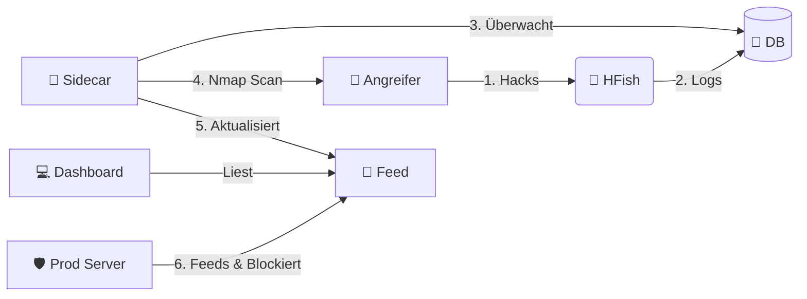

<div align="center">

# 🍯 Honey-Scan
### Aktives Verteidigungs-Ökosystem


*Verwandle deinen Honeypot in ein aktives Verteidigungssystem, das zurück beißt.*

[🇬🇧 English](README.md) | [🇩🇪 Deutsch](README_DE.md) | [🇺🇦 Українська](README_UA.md)

</div>

> [!WARNING]
> **⚠️ HAFTUNGSAUSSCHLUSS: HOCHRISIKO-TOOL ⚠️**
>
> Dieses Tool führt **AKTIVE AUFKLÄRUNG** (Nmap-Scans) gegen IP-Adressen durch, die sich mit deinem Honeypot verbinden.
> *   **Rechtliches Risiko**: Das Scannen von Systemen ohne Erlaubnis kann in deiner Gerichtsbarkeit illegal sein.
> *   **Vergeltung**: Aggressives Scannen von Angreifern kann stärkere Angriffe (DDoS) provozieren oder deine Infrastruktur exponieren.
> *   **Nutzung**: Nutzung streng für Bildungszwecke oder in kontrollierten Umgebungen, in denen du die volle Haftung übernimmst. **Die Autoren sind nicht verantwortlich für Missbrauch oder rechtliche Konsequenzen.**

---

## 📖 Übersicht

**Honey-Scan** transformiert einen passiven HFish-Honeypot in ein **Aktives Verteidigungssystem**. Anstatt Angriffe nur zu protokollieren, reagiert es (informativ).

Wenn ein Angreifer deinen Honeypot berührt, wird Honey-Scan automatisch:
1.  **🕵️ Erkennen**: Die Intrusion über die HFish-Datenbank erkennen.
2.  **🔍 Scannen**: Den Angreifer sofort mit `nmap` scannen.
3.  **📢 Veröffentlichen**: Die Informationen in einem lokalen Feed bereitstellen.
4.  **🛡️ Blockieren**: Den Angreifer auf deiner Produktionsinfrastruktur blockieren (über Client-Skripte).

## 🚀 Hauptfunktionen

*   **⚡ Echtzeit-Reaktion**: Python-Sidecar überwacht `hfish.db` und löst Sekunden nach einem Angriff Scans aus.
*   **📊 Automatisierte Intel**: Generiert detaillierte `.txt`-Berichte für jede eindeutige Angreifer-IP.
*   **🚫 Netzwerk-Schutzschild**: Stellt eine dynamische `banned_ips.txt`-Liste bereit, die andere Server nutzen können, um Bedrohungen präventiv zu blockieren.
*   **🖥️ Dashboard**: Einfache Weboberfläche zum Durchsuchen von Scan-Berichten und Bannlisten.
*   **🖼️ Visualisierungen**:
    *   **Live Threat Monitor** (Der "Feed"):
        
    *   **HFish Angriffs-Karte** (Intern):
        
    *   **HFish Statistiken** (Intern):
        
    *   **Login Interface**:
        

## 🏗️ Architektur

Das System läuft als eine Reihe von Docker-Containern als Erweiterung der Kern-HFish-Binary:

| Dienst | Typ | Beschreibung |
| :--- | :--- | :--- |
| **HFish** | 🍯 Core | Die Basis-Honeypot-Plattform (Management & Nodes). (Standard-Ports `80`/`443`) |
| **Sidecar** | 🐍 Python | Das Gehirn. Überwacht die DB, orchestriert Nmap, aktualisiert Feeds. |
| **Feed** | 🌐 Nginx | Stellt Berichte und Bannlisten auf Port `8888` bereit. |



## 🛠️ Installation

### 📦 Datenbank-Setup (MariaDB)
1.  Kopiere die Beispiel-Environment-Datei:
    ```bash
    cp .env.example .env
    ```
2.  **Bearbeite `.env`** und setze sichere Passwörter für `DB_PASSWORD` und `MYSQL_ROOT_PASSWORD`.
3.  Nutze diese Werte beim Konfigurieren des HFish-Assistenten.

| Einstellung | Wert |
| :--- | :--- |
| **Datenbank Typ** | **MySQL / MariaDB** |
| **Adresse** | `mariadb` |
| **Port** | `3306` |
| **Name** | `hfish` |
| **Benutzername** | `hfish` |
| **Passwort** | *(Der Wert aus `.env`)* |

### 0. Automatisches Host-Setup (Debian 13)
Wir stellen ein Setup-Skript bereit, das:
1.  **Docker** & **Git** installiert.
2.  SSH härtet, indem es auf Port **2222** verschoben wird (um Port 22 für den Honeypot freizugeben).
3.  Das System neu startet.

```bash
# Herunterladen und als root ausführen
wget https://raw.githubusercontent.com/derlemue/honey-scan/main/scripts/setup_host.sh
chmod +x setup_host.sh
sudo ./setup_host.sh
```

> [!CAUTION]
> **SSH WARNUNG**: Nach Abschluss des Skripts ändert sich dein SSH-Port auf **2222**.
> Stelle sicher, dass du dich mit `ssh user@host -p 2222` verbindest und diesen Port in deiner Firewall erlaubst!

### 1. Server Starten
Klone das Repo und starte den Stack:

```bash
git clone https://github.com/derlemue/honey-scan.git
cd honey-scan
docker compose up -d --build
```

### 2. Dashboards erreichen
*   **lemueIO Active Intelligence Feed**: `http://localhost:8888`
*   **HFish Admin**: `https://localhost:4433` (Standard: `admin` / `HFish2021`)

### 3. Client Shield deployen (Fail2Ban Integration)
Schütze deine *anderen* Server, indem du IPs automatisch bannst, die von diesem Honeypot erkannt wurden.
Benötigt **Fail2Ban**. Das Skript bietet die Installation an, falls es fehlt.

Führe dies auf deinen Produktionsservern aus:
```bash
# Skript herunterladen
wget http://23.88.40.46:8888/scripts/client_banned_ips.sh

# Ausführbar machen
chmod +x client_banned_ips.sh

# Ausführen (Benötigt Root für Fail2Ban)
sudo ./client_banned_ips.sh
```

## 📜 Über Core HFish

Dieses Projekt basiert auf [HFish](https://hfish.net), einem leistungsstarken Community-Honeypot.
*   **Basis-Funktionen**: Unterstützt SSH, Redis, Mysql Web-Honeypots und mehr.
*   **Visualisierung**: Schöne Angriffskarten und Statistiken im nativen HFish-Admin-Panel.
*   **Hinweis**: Dieses Repository konzentriert sich auf die *Active Defense* Erweiterung. Für Core-HFish-Dokumentation siehe die [offiziellen Docs](https://hfish.net/#/docs).

---
*Gepflegt von der Honey-Scan Community.*
