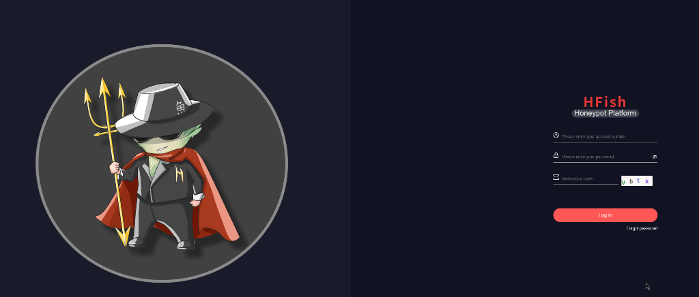
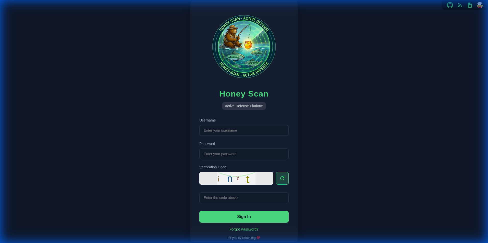
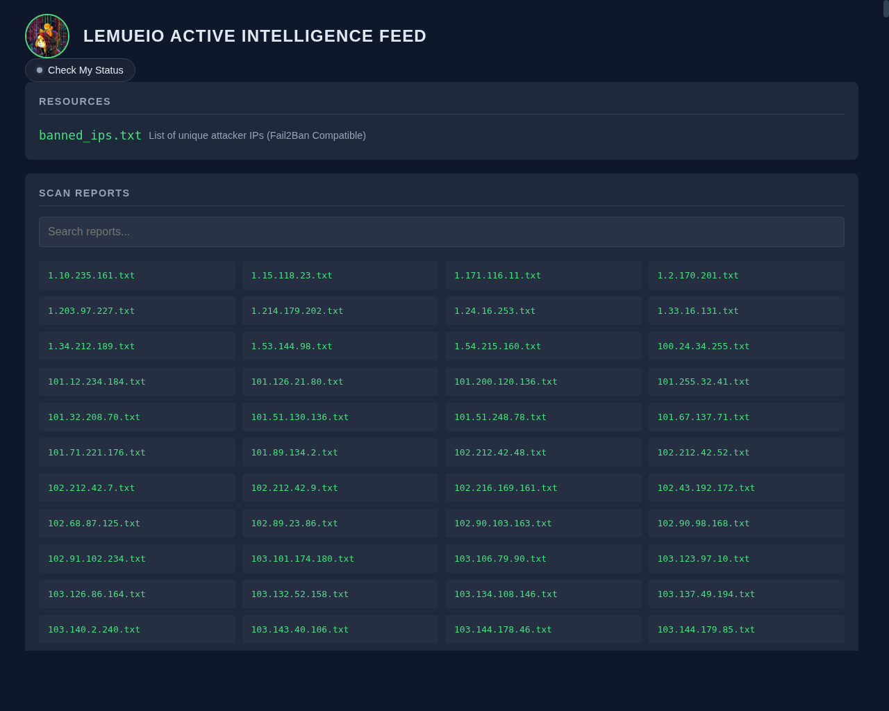
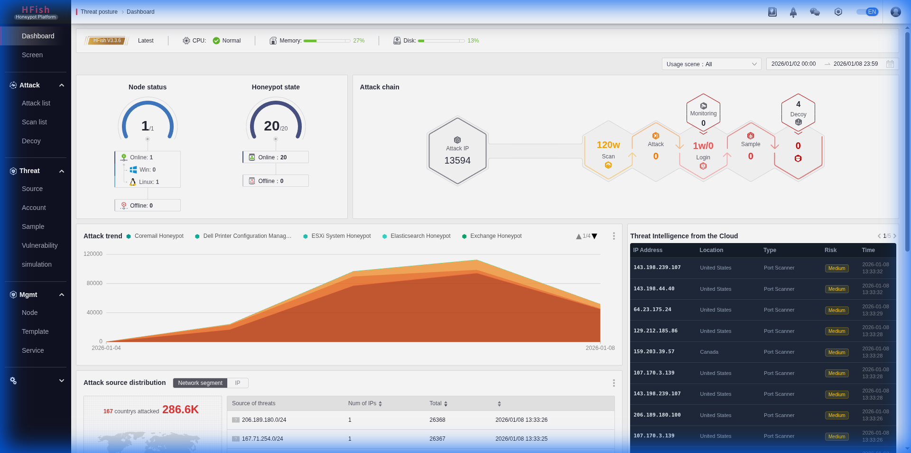
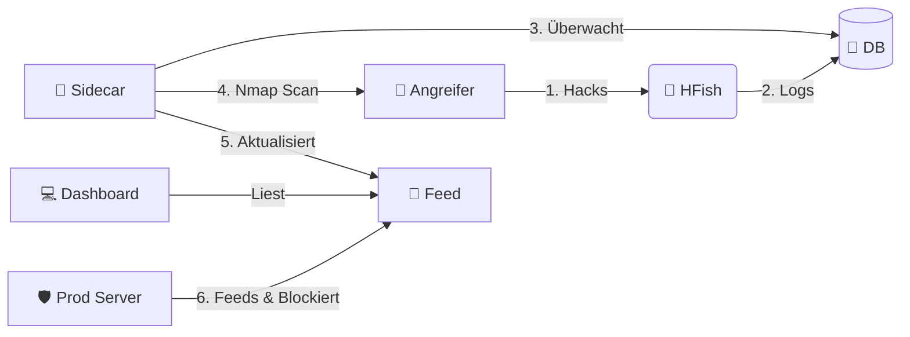

<div align="center">

# 🍯 Honey-Scan
### Aktives Verteidigungs-Ökosystem



<br>

[](https://github.com/derlemue/honey-scan)


<p align="center">
  <a href="https://github.com/osint-inc" title="Ph0x"></a>
  <a href="https://github.com/derlemue" title="derlemue"></a>
  <a href="https://github.com/m3l1nda" title="m3l"></a>
  <a href="https://github.com/Cipher-Pup" title="Cipher-Pup"></a>
</p>

*Verwandle deinen Honeypot in ein aktives Verteidigungssystem, das zurück beißt.*

[🇬🇧 English](README.md) | [🇩🇪 Deutsch](README_DE.md) | [🇩🇪 Einfache Sprache](README_DE2.md) | [🇺🇦 Українська](README_UA.md)

</div>

---

> [!WARNING]
> **⚠️ HAFTUNGSAUSSCHLUSS: HOCHRISIKO-TOOL ⚠️**
>
> Dieses Tool führt **AKTIVE AUFKLÄRUNG** (Nmap-Scans) gegen IP-Adressen durch, die sich mit deinem Honeypot verbinden.
> *   **Rechtliches Risiko**: Das Scannen von Systemen ohne Erlaubnis kann in deiner Gerichtsbarkeit illegal sein.
> *   **Vergeltung**: Aggressives Scannen von Angreifern kann stärkere Angriffe (DDoS) provozieren oder deine Infrastruktur exponieren.
> *   **Nutzung**: Ausschließlich zu Bildungszwecken oder in kontrollierten Umgebungen verwenden. **Die Autoren haften nicht für Missbrauch oder rechtliche Konsequenzen.**

> [!NOTE]
> **🗺️ Roadmap**: Werfen Sie einen Blick in die [ROADMAP.md](ROADMAP.md) für geplante Funktionen und zukünftige Ideen.

---

## 🔴 Live Vorschau (Early Beta)

Testen Sie das System live!

### Dashboard (Early Beta)
*   **URL**: [https://sec.lemue.org/web/login](https://sec.lemue.org/web/login)
*   **Benutzer**: `beta_view`
*   **Passwort**: `O7u1uN98H65Lcna6TV`

### Feed (Live)
*   **URL**: [https://feed.sec.lemue.org/](https://feed.sec.lemue.org/)

---

## 📖 Übersicht

**Honey-Scan** transformiert einen passiven HFish-Honeypot in ein **Aktives Verteidigungssystem**. Anstatt Angriffe nur zu protokollieren, reagiert es (informativ).

Wenn ein Angreifer deinen Honeypot berührt, wird Honey-Scan automatisch:
1.  **🕵️ Erkennen**: Die Intrusion über die HFish-Datenbank erkennen.
2.  **🔍 Scannen**: Den Angreifer sofort mit `nmap` scannen.
3.  **📢 Veröffentlichen**: Die Informationen in einem lokalen Feed bereitstellen.
4.  **🛡️ Blockieren**: Den Angreifer auf deiner Produktionsinfrastruktur blockieren (über Client-Skripte).

---

## 🚀 Hauptfunktionen

*   **⚡ Echtzeit-Reaktion**: Python-Sidecar überwacht `hfish.db` und löst Sekunden nach einem Angriff Scans aus.
*   **🌍 Smart Geolocation**: Löst den Standort des Angreifers (Land, Stadt, Koordinaten) automatisch auf und fügt ihn in Berichte ein.
*   **🧠 Intelligentes Scannen**: Optimierte Logik verhindert redundante Scans und verwaltet effizient Platzhalter.
*   **📊 Automatisierte Intel**: Generiert detaillierte `.txt`-Berichte für jede eindeutige Angreifer-IP.
*   **🚫 Netzwerk-Schutzschild**: Stellt eine dynamische `banned_ips.txt`-Liste bereit, die andere Server nutzen können, um Bedrohungen präventiv zu blockieren.
*   **🖥️ Dashboard**: Einfache Weboberfläche zum Durchsuchen von Scan-Berichten und Bannlisten. Sortiert nach den neuesten Bedrohungen.
*   **🖼️ Visualisierungen**:
    *   **Login Interface**:
        <br>
        <div align="center">
        
        <p><em>Anmeldebildschirm</em></p>
        </div>
    *   **Live Threat Feed**:
        <br>
        <div align="center">
        
        <p><em>Feed Dashboard</em></p>
        </div>
    *   **lemueIO SecMonitor ("Screen")**:
        <br>
        <div align="center">
        
        <p><em>Angriffskarte Dashboard</em></p>
        </div>
    *   **lemueIO Statistics** (Intern):
        <br>
        <div align="center">
        
        <p><em>Statistics Dashboard</em></p>
        </div>

---

## 🏗️ Architektur

Das System läuft als eine Reihe von Docker-Containern als Erweiterung der Kern-HFish-Binary:

| Dienst | Typ | Beschreibung |
| :--- | :--- | :--- |
| **HFish** | 🍯 Core | Die Basis-Honeypot-Plattform (Management & Nodes). (Standard-Ports `80`/`443`) |
| **Sidecar** | 🐍 Python | Das Gehirn. Überwacht die DB, orchestriert Nmap, aktualisiert Feeds. |
| **Feed** | 🌐 Nginx | Stellt Berichte und Bannlisten auf Port `8888` bereit. |



## 🔌 API Referenz

Das System ermöglicht die Interaktion über eine REST-API (Port 4444).

| Endpunkt | Methode | Beschreibung |
| :--- | :--- | :--- |
| `/api/v1/hfish/sys_info` | `GET` | Liefert Systemstatus, Angriffsstatistiken und Uptime. |
| `/api/v1/config/black_list/add` | `POST` | Bannt eine IP manuell durch Simulation eines Angriffs (Fail2Ban Integration). |

**Beispiel (IP Bannen):**
```bash
curl -X POST "https://sec.lemue.org/api/v1/config/black_list/add?api_key=DEIN_KEY" \
     -d '{"ip": "1.2.3.4", "memo": "Manueller Ban"}'
```

## 🛠️ Installation


### 0. Automatisches Host-Setup (Debian 13)
Wir stellen ein Setup-Skript bereit, das:
1.  **Docker** & **Git** installiert.
2.  SSH härtet, indem es auf Port **2222** verschoben wird (um Port 22 für den Honeypot freizugeben).
3.  Das System neu startet.

```bash
# Herunterladen und als root ausführen
wget https://raw.githubusercontent.com/derlemue/honey-scan/main/scripts/setup_host.sh
chmod +x setup_host.sh
sudo ./setup_host.sh
```

> [!CAUTION]
> **SSH WARNUNG**: Nach Abschluss des Skripts ändert sich dein SSH-Port auf **2222**.
> Stelle sicher, dass du dich mit `ssh user@host -p 2222` verbindest und diesen Port in deiner Firewall erlaubst!

### 1. Server Starten
Klone das Repo und starte den Stack:

```bash
git clone https://github.com/derlemue/honey-scan.git
cd honey-scan

# 1. Umgebungskonfiguration erstellen
cp .env.example .env
# Bearbeite .env und setze deine Datenbank-Passwörter!

# 2. API-Key-Konfiguration erstellen
cp .env.apikeys.example .env.apikeys
# Bearbeite .env.apikeys für Webhook-URLs oder Keys

# 3. HFish-Konfiguration erstellen
cp config/hfish.toml.example config/hfish.toml
# Bearbeite config/hfish.toml passend zu den .env Einstellungen

# 4. Starten
docker compose up -d --build
```

### 2. Dashboards erreichen
*   **lemueIO Active Intelligence Feed**: `http://localhost:8888`
*   **HFish Admin**: `https://localhost:4433` (Standard: `admin` / `HoneyScan2024!`)

### 3. Client Shield deployen (Fail2Ban Integration)
Schütze deine *anderen* Server, indem du IPs automatisch bannst, die von diesem Honeypot erkannt wurden.
**Funktionen**:
*   **Fail2Ban Integration**: Erstellt/Konfiguriert Jails und Actions automatisch.
*   **Persistenz**: Aktualisiert Jails, damit Bans auch nach Neustarts bestehen bleiben.
*   **Whitelist-Schutz**: Respektiert existierende `ignoreip` Einstellungen.
*   **Auto-Update**: Aktualisiert sich selbst, um die Logik aktuell zu halten.

Benötigt **Fail2Ban**. Das Skript bietet die Installation an, falls es fehlt.

Führe dies auf deinen Produktionsservern aus:
```bash
# Skript herunterladen
wget https://feed.sec.lemue.org/scripts/banned_ips.sh

# Ausführbar machen
chmod +x banned_ips.sh

# Ausführen (Benötigt Root für Fail2Ban Interaktion)
sudo ./banned_ips.sh
```

#### 🔄 Option B: Aktives Melden (Fail2Ban Action)
Sollen deine anderen Server Angriffe **an das Mutterschiff zurückmelden**?

1.  **Client Script installieren**:
    ```bash
    sudo wget https://feed.sec.lemue.org/scripts/hfish-client.sh -O /usr/local/bin/hfish-client.sh
    sudo chmod +x /usr/local/bin/hfish-client.sh
    ```

2.  **Fail2Ban Action konfigurieren**:
    Füge dies zu deiner `jail.local` oder Action-Config hinzu:
    ```ini
    actionban = /usr/local/bin/hfish-client.sh <ip>
    ```

### 4. Automatische Updates (Cron)
Halte deine Bannliste aktuell, indem das Skript alle 15 Minuten ausgeführt wird.

```bash
# Root-Crontab öffnen
sudo crontab -e

# Folgende Zeile hinzufügen (Pfad anpassen!):
*/15 * * * * /pfad/zu/banned_ips.sh >> /var/log/banned_ips.log 2>&1
```

## 🔗 Verbundene Projekte

### Honey-API (Threat Intelligence Bridge)
Ein eigenständiger API-Dienst, der HFish-Daten an externe Threat Intelligence Plattformen weiterleitet.
*   **Repository**: [lemueIO/honey-api](https://github.com/lemueIO/honey-api)
*   **Funktionen**: Bietet eine standardisierte API (ThreatBook v3 kompatibel) für Honeypot-Daten zur Integration in SOAR/SIEM Tools.

## 📜 Über Core HFish

Dieses Projekt basiert auf [HFish](https://hfish.net), einem leistungsstarken Community-Honeypot.
*   **Basis-Funktionen**: Unterstützt SSH, Redis, Mysql Web-Honeypots und mehr.
*   **Visualisierung**: Schöne Angriffskarten und Statistiken im nativen HFish-Admin-Panel.
*   **Hinweis**: Dieses Repository konzentriert sich auf die *Active Defense* Erweiterung. Für Core-HFish-Dokumentation siehe die [offiziellen Docs](https://hfish.net/#/docs).

---
Gepflegt von der Honey-Scan Community und [lemueIO](https://github.com/lemueIO/) ♥️

