<div align="center">

# 🍯 Honey-Scan
### Aktive Verteidigung


<br>

[](https://github.com/derlemue/honey-scan)


<br>


<p align="center">
  <a href="https://github.com/osint-inc" title="Ph0x"></a>
  <a href="https://github.com/derlemue" title="derlemue"></a>
  <a href="https://github.com/m3l1nda" title="m3l"></a>
  <a href="https://github.com/Cipher-Pup" title="Cipher-Pup"></a>
</p>

*Mach deinen Honeypot stark. Er soll sich wehren.*

[🇬🇧 English](README.md) | [🇩🇪 Deutsch](README_DE.md) | [🇩🇪 Einfache Sprache](README_DE2.md) | [🇺🇦 Українська](README_UA.md)

</div>

---

> [!WARNING]
> **⚠️ ACHTUNG: GEFÄHRLICHES WERKZEUG ⚠️**
>
> Dieses Programm scannt Angreifer zurück (Nmap).
> *   **Gefahr**: Das kann illegal sein.
> *   **Risiko**: Angreifer könnten wütend werden und stärker angreifen.
> *   **Benutzung**: Nur zum Lernen benutzen. Du bist selbst verantwortlich. Wir sind nicht schuld, wenn etwas passiert.

---

> [!NOTE]
> **🗺️ Roadmap**: In der Datei [ROADMAP.md](ROADMAP.md) steht, was wir als nächstes vorhaben.

---

## 🔴 Live Vorschau (Early Beta)

Probieren Sie es aus!

### Dashboard (Early Beta)
*   **URL**: [https://sec.lemue.org/web/login](https://sec.lemue.org/web/login)
*   **Benutzer**: `beta_view`
*   **Passwort**: `O7u1uN98H65Lcna6TV`

### Feed (Live)
*   **URL**: [https://feed.sec.lemue.org/](https://feed.sec.lemue.org/)

---

## 📖 Übersicht

**Honey-Scan** macht aus einem normalen Honeypot (HFish) eine **Aktive Verteidigung**.
Ein normaler Honeypot sammelt nur Daten. Honey-Scan beißt zurück.

Wenn dich jemand angreift:
1.  **🕵️ Merken**: Das System merkt den Angriff in der Datenbank.
2.  **🔍 Scannen**: Das System scannt den Angreifer sofort zurück. Das macht `nmap`.
3.  **📢 Teilen**: Das System schreibt einen Bericht. Es kommt in einen "Feed".
4.  **🛡️ Blocken**: Deine anderen Server können den Angreifer sehen und blockieren.

---

## 🚀 Haupt-Funktionen

*   **⚡ Schnell**: Es reagiert in Sekunden. Ein Python-Programm passt auf.
*   **🌍 Kluger Standort**: Es findet heraus, wo der Angreifer wohnt (Land, Stadt).
*   **🧠 Schlaues Scannen**: Es scannt nicht doppelt und arbeitet effizient.
*   **📊 Berichte**: Es macht Text-Dateien mit Infos über den Angreifer.
*   **🚫 Schutz-Liste**: Es gibt eine Liste mit bösen IPs (`banned_ips.txt`). Deine Server können diese Liste nutzen, um sich zu schützen.
*   **🖥️ Übersicht**: Es gibt eine Webseite. Da sieht man die Berichte. Die neusten sind oben.
*   **🖼️ Bilder**:
    *   **Login Seite**:
        <br>
        <div align="center">
        
        <p><em>Login Seite</em></p>
        </div>
    *   **Live Bericht**:
        <br>
        <div align="center">
        
        <p><em>Feed Dashboard</em></p>
        </div>
    *   **Weltkarte ("Screen")**:
        <br>
        <div align="center">
        
        <p><em>Angriffs-Karte</em></p>
        </div>
    *   **Statistik**:
        <br>
        <div align="center">
        
        <p><em>Statistik Seite</em></p>
        </div>

---

## 🏗️ Aufbau

Es sind Container (Docker). Sie erweitern das Programm HFish:

| Teil | Art | Was er macht |
| :--- | :--- | :--- |
| **HFish** | 🍯 Kern | Der Honigtopf. Er lockt Angreifer an. (Port `80` und `443`) |
| **Sidecar** | 🐍 Python | Das Gehirn. Es merkt Angriffe und startet den Scan. |
| **Feed** | 🌐 Nginx | Die Webseite. Sie zeigt die Berichte. (Port `8888`) |

## 🔌 API (Schnittstelle)

Du kannst das System auch per Programm steuern (Port 4444).

| Befehl | Was passiert? |
| :--- | :--- |
| `/api/v1/hfish/sys_info` | Zeigt Gesundheit und Statistiken. |
| `/api/v1/config/black_list/add` | Bannt eine IP sofort. |

**Beispiel:**
```bash
curl -X POST "https://sec.lemue.org/api/v1/config/black_list/add?api_key=DEIN_KEY" \
     -d '{"ip": "1.2.3.4", "memo": "Bannen"}'
```



```mermaid
graph LR
    A[👹 Angreifer] -- 1. Hackt --> B(🍯 HFish)
    B -- 2. Speichert --> C[(💽 Datenbank)]
    D[🐍 Sidecar] -- 3. Schaut --> C
    D -- 4. Scannt --> A
    D -- 5. Schreibt --> E[📂 Feed]
    F[💻 Dashboard] -- Liest --> E
    G[🛡️ Server] -- 6. Liest & Blockt --> E
```

## 🛠️ Installation


### 0. Automatische Einrichtung (Debian 13)
Wir haben ein Skript. Es macht alles automatisch:
1.  Es installiert **Docker** und **Git**.
2.  Es ändert den SSH Port auf **2222** (damit Port 22 frei ist).
3.  Es startet den Computer neu.

```bash
# Herunterladen und als Chef (root) starten
wget https://raw.githubusercontent.com/derlemue/honey-scan/main/scripts/setup_host.sh
chmod +x setup_host.sh
sudo ./setup_host.sh
```

> [!CAUTION]
> **SSH WARNUNG**: Dein SSH Port ist danach **2222**.
> Verbinde dich so: `ssh user@host -p 2222`. Erlaube den Port in der Firewall!

### 1. Starten
Lade das Programm herunter und starte es:

```bash
git clone https://github.com/derlemue/honey-scan.git
cd honey-scan

# 1. Einstellungen kopieren
cp .env.example .env
# WICHTIG: Schreibe dein Passwort in .env!

# 2. Schlüssel kopieren
cp .env.apikeys.example .env.apikeys

# 3. HFish Einstellung kopieren
cp config/hfish.toml.example config/hfish.toml
# Bearbeite die Datei wenn nötig

# 4. Starten
docker compose up -d --build
```

### 2. Anschauen
*   **Berichte**: `http://localhost:8888`
*   **Admin**: `https://localhost:4433` (Login: `admin` / `HoneyScan2024!`)

### 3. Schutz für andere Server (Fail2Ban)
Schütze deine anderen Server. Sie sollen die Angreifer automatisch blockieren.
**Was es kann**:
*   **Fail2Ban**: Es stellt Fail2Ban automatisch richtig ein.
*   **Merken**: Es vergisst keine blockierten Angreifer.
*   **Freunde**: Es blockiert keine Freunde (Whitelist).
*   **Neu**: Es kann sich selbst aktualisieren.

Du brauchst **Fail2Ban**. Das Skript installiert es, wenn es fehlt.

Mache das auf deinen echten Servern:
```bash
# Herunterladen
wget https://feed.sec.lemue.org/scripts/banned_ips.sh

# Startklar machen
chmod +x banned_ips.sh

# Starten (als Chef/Root)
sudo ./banned_ips.sh
```

#### 🔄 Option B: Zurück-Melden
Willst du Angriffe an den Haupt-Server melden?

1.  **Script laden**:
    ```bash
    sudo wget https://feed.sec.lemue.org/scripts/hfish-client.sh -O /usr/local/bin/hfish-client.sh
    sudo chmod +x /usr/local/bin/hfish-client.sh
    ```

2.  **Fail2Ban einstellen**:
    Schreibe das in deine Konfiguration:
    ```ini
    actionban = /usr/local/bin/hfish-client.sh <ip>
    ```

### 4. Automatisch neu laden
Die Liste soll immer aktuell sein. Mache das alle 15 Minuten.

```bash
# Planer öffnen (als Chef/Root)
sudo crontab -e

# Das hier eintragen (Pfad anpassen):
*/15 * * * * /pfad/zu/banned_ips.sh >> /var/log/banned_ips.log 2>&1
```

## 🔗 Andere Projekte

### Honey-API (Bedrohungs-Brücke)
Ein Programm, das die Daten vom Honeypot an andere Systeme sendet.
*   **Code**: [lemueIO/honey-api](https://github.com/lemueIO/honey-api)
*   **Was es macht**: Es hilft, die Daten in Sicherheits-Systeme (SIEM) zu bekommen.

## 📜 Über HFish

Dieses Projekt basiert auf [HFish](https://hfish.net). Das ist ein bekannter Honeypot.
*   **Funktionen**: Es kann SSH, Redis, Mysql und mehr simulieren.
*   **Bilder**: Es hat schöne Karten und Statistiken.
*   **Hinweis**: Hier geht es um die Erweiterung (Aktive Verteidigung). Für HFish selbst, schau in die [Anleitung von HFish](https://hfish.net/#/docs).

---
*Gemacht von der Honey-Scan Community und [lemueIO](https://github.com/lemueIO/) ♥️*

