<div align="center">

# 🍯 Honey-Scan
### Aktive Verteidigung


<br>


*Mach deinen Honeypot stark. Er soll sich wehren.*

[🇬🇧 English](README.md) | [🇩🇪 Deutsch](README_DE.md) | [🇩🇪 Einfache Sprache](README_DE2.md) | [🇺🇦 Українська](README_UA.md)

</div>

---

> [!WARNING]
> **⚠️ ACHTUNG: GEFÄHRLICHES WERKZEUG ⚠️**
>
> Dieses Programm scannt Angreifer zurück (Nmap).
> *   **Gefahr**: Das kann illegal sein.
> *   **Risiko**: Angreifer könnten wütend werden und stärker angreifen.
> *   **Benutzung**: Nur zum Lernen benutzen. Du bist selbst verantwortlich. Wir sind nicht schuld, wenn etwas passiert.

---

## 🔴 Live Vorschau (Early Beta)

Probieren Sie es aus!

### Dashboard (Early Beta)
*   **URL**: [https://sec.lemue.org/web/login](https://sec.lemue.org/web/login)
*   **Benutzer**: `beta_view`
*   **Passwort**: `O7u1uN98H65Lcna6TV`

### Feed (Live)
*   **URL**: [https://feed.sec.lemue.org/](https://feed.sec.lemue.org/)

---

## 📖 Übersicht

**Honey-Scan** macht aus einem normalen Honeypot (HFish) eine **Aktive Verteidigung**.
Ein normaler Honeypot sammelt nur Daten. Honey-Scan beißt zurück.

Wenn dich jemand angreift:
1.  **🕵️ Merken**: Das System merkt den Angriff in der Datenbank.
2.  **🔍 Scannen**: Das System scannt den Angreifer sofort zurück. Das macht `nmap`.
3.  **📢 Teilen**: Das System schreibt einen Bericht. Es kommt in einen "Feed".
4.  **🛡️ Blocken**: Deine anderen Server können den Angreifer sehen und blockieren.

---

## 🚀 Haupt-Funktionen

*   **⚡ Schnell**: Es reagiert in Sekunden. Ein Python-Programm passt auf.
*   **📊 Berichte**: Es macht Text-Dateien mit Infos über den Angreifer.
*   **🚫 Schutz-Liste**: Es gibt eine Liste mit bösen IPs (`banned_ips.txt`). Deine Server können diese Liste nutzen, um sich zu schützen.
*   **🖥️ Übersicht**: Es gibt eine Webseite. Da sieht man die Berichte.
*   **🖼️ Bilder**:
    *   **Login Seite**:
        <br>
        <div align="center">
        
        <p><em>Login Seite</em></p>
        </div>
    *   **Live Bericht**:
        <br>
        <div align="center">
        
        <p><em>Berichte Übersicht</em></p>
        </div>
    *   **Weltkarte ("Screen")**:
        <br>
        <div align="center">
        
        <p><em>Angriffs-Karte</em></p>
        </div>
    *   **Statistik**:
        <br>
        <div align="center">
        
        <p><em>Statistik Seite</em></p>
        </div>

---

## 🏗️ Aufbau

Es sind Container (Docker). Sie erweitern das Programm HFish:

| Teil | Art | Was er macht |
| :--- | :--- | :--- |
| **HFish** | 🍯 Kern | Der Honigtopf. Er lockt Angreifer an. (Port `80` und `443`) |
| **Sidecar** | 🐍 Python | Das Gehirn. Es merkt Angriffe und startet den Scan. |
| **Feed** | 🌐 Nginx | Die Webseite. Sie zeigt die Berichte. (Port `8888`) |



```mermaid
graph LR
    A[👹 Angreifer] -- 1. Hackt --> B(🍯 HFish)
    B -- 2. Speichert --> C[(💽 Datenbank)]
    D[🐍 Sidecar] -- 3. Schaut --> C
    D -- 4. Scannt --> A
    D -- 5. Schreibt --> E[📂 Feed]
    F[💻 Dashboard] -- Liest --> E
    G[🛡️ Server] -- 6. Liest & Blockt --> E
```

## 🛠️ Installation

### 📦 Datenbank (MariaDB)
1.  Kopiere die Datei für Einstellungen:
    ```bash
    cp .env.example .env
    ```
2.  **Bearbeite `.env`**. Schreibe sichere Passwörter bei `DB_PASSWORD` und `MYSQL_ROOT_PASSWORD`.
3.  Benutze diese Daten beim HFish Start:

| Feld | Wert |
| :--- | :--- |
| **Datenbank Typ** | **MySQL / MariaDB** |
| **Adresse** | `127.0.0.1` |
| **Port** | `3307` |
| **Name** | `hfish` |
| **Benutzer** | `hfish` |
| **Passwort** | *(Dein Passwort aus der .env Datei)* |

### 0. Automatische Einrichtung (Debian 13)
Wir haben ein Skript. Es macht alles automatisch:
1.  Es installiert **Docker** und **Git**.
2.  Es ändert den SSH Port auf **2222** (damit Port 22 frei ist).
3.  Es startet den Computer neu.

```bash
# Herunterladen und als Chef (root) starten
wget https://raw.githubusercontent.com/derlemue/honey-scan/main/scripts/setup_host.sh
chmod +x setup_host.sh
sudo ./setup_host.sh
```

> [!CAUTION]
> **SSH WARNUNG**: Dein SSH Port ist danach **2222**.
> Verbinde dich so: `ssh user@host -p 2222`. Erlaube den Port in der Firewall!

### 1. Starten
Lade das Programm herunter und starte es:

```bash
git clone https://github.com/derlemue/honey-scan.git
cd honey-scan
docker compose up -d --build
```

### 2. Anschauen
*   **Berichte**: `http://localhost:8888`
*   **Admin**: `https://localhost:4433` (Login: `admin` / `HFish2021`)

### 3. Schutz für andere Server (Fail2Ban)
Schütze deine anderen Server. Sie sollen die Angreifer automatisch blockieren.
Du brauchst **Fail2Ban**. Das Skript installiert es, wenn es fehlt.

Mache das auf deinen echten Servern:
```bash
# Skript holen
wget https://feed.sec.lemue.org/scripts/client_banned_ips.sh

# Ausführbar machen
chmod +x client_banned_ips.sh

# Starten (braucht Root Rechte)
sudo ./client_banned_ips.sh
```

### 4. Automatisch neu laden
Die Liste soll immer aktuell sein. Mache das alle 15 Minuten.

```bash
# Planer öffnen (als Chef/Root)
sudo crontab -e

# Das hier eintragen (Pfad anpassen):
*/15 * * * * /pfad/zur/datei/client_banned_ips.sh > /dev/null 2>&1
```

## 📜 Über HFish

Dieses Projekt basiert auf [HFish](https://hfish.net). Das ist ein bekannter Honeypot.
*   **Funktionen**: Es kann SSH, Redis, Mysql und mehr simulieren.
*   **Bilder**: Es hat schöne Karten und Statistiken.
*   **Hinweis**: Hier geht es um die Erweiterung (Aktive Verteidigung). Für HFish selbst, schau in die [Anleitung von HFish](https://hfish.net/#/docs).

---
*Gemacht von der Honey-Scan Community.*
