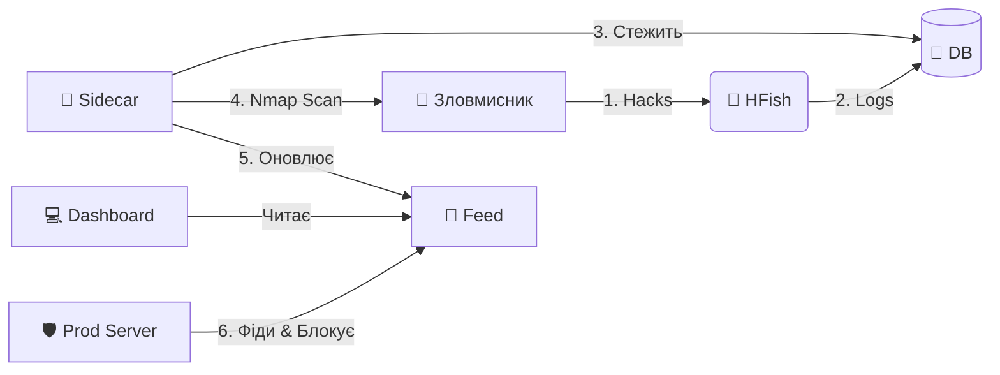

<div align="center">
    
    <h1>Honey Scan</h1>
    <p><b>Платформа Активного Захисту та Розвідки Загроз</b></p>

[](https://github.com/derlemue/honey-scan)


<p align="center">
  <a href="https://github.com/osint-inc" title="Ph0x"></a>
  <a href="https://github.com/derlemue" title="derlemue"></a>
  <a href="https://github.com/m3l1nda" title="m3l"></a>
  <a href="https://github.com/Cipher-Pup" title="Cipher-Pup"></a>
</p>

*Перетворіть ваш ханіпот на систему активного захисту, що дає відсіч.*

[🇬🇧 English](README.md) | [🇩🇪 Deutsch](README_DE.md) | [🇩🇪 Einfache Sprache](README_DE2.md) | [🇺🇦 Українська](README_UA.md)

</div>

---

> [!WARNING]
> **⚠️ ВІДМОВА ВІД ВІДПОВІДАЛЬНОСТІ: ІНСТРУМЕНТ ВИСОКОГО РИЗИКУ ⚠️**
>
> Цей інструмент виконує **АКТИВНУ РОЗВІДКУ** (сканування Nmap) проти IP-адрес, які підключаються до вашого ханіпоту.
> *   **Юридичний ризик**: Сканування систем без дозволу може бути незаконним у вашій юрисдикції.
> *   **Відплата**: Агресивне сканування зловмисників може спровокувати сильніші атаки (DDoS) або розкрити вашу інфраструктуру.
> *   **Використання**: Використовуйте виключно в освітніх цілях або в контрольованих середовищах. **Автори не несуть відповідальності за будь-яке зловживання або правові наслідки.**

> [!NOTE]
> **🗺️ Roadmap**: Перегляньте [ROADMAP.md](ROADMAP.md), щоб дізнатися про заплановані функції та майбутні ідеї.

---

## 🔴 Живий перегляд (Early Beta)

Спробуйте систему наживо!

### Інформаційна панель (Early Beta)
*   **URL**: [https://sec.lemue.org/web/login](https://sec.lemue.org/web/login)
*   **Користувач**: `beta_view`
*   **Пароль**: `O7u1uN98H65Lcna6TV`

### Стрічка загроз (Live)
*   **URL**: [https://feed.sec.lemue.org/](https://feed.sec.lemue.org/)

---

## 📖 Огляд

**Honey-Scan** перетворює пасивний ханіпот HFish на **Систему Активного Захисту**. Замість того, щоб просто реєструвати атаки, вона реагує (інформативно).

Коли зловмисник торкається вашого ханіпоту, Honey-Scan автоматично:
1.  **🕵️ Виявляє** вторгнення через базу даних HFish.
2.  **🔍 Сканує** зловмисника негайно за допомогою `nmap`.
3.  **📢 Публікує** розвідувальні дані в локальний канал (фід).
4.  **🛡️ Блокує** зловмисника на вашій виробничій інфраструктурі (через клієнтські скрипти).

---

## 🚀 Основні функції

*   **⚡ Реакція в реальному часі**: Python-сайдкар моніторить `hfish.db` і запускає сканування через секунди після атаки.
*   **🌍 Розумна геолокація**: Автоматично визначає місцезнаходження зловмисника (Країна, Місто, Координати).
*   **🧠 Інтелектуальне сканування**: Оптимізована логіка запобігає зайвим скануванням.
*   **📊 Автоматизована розвідка**: Генерує детальні `.txt` звіти для кожної унікальної IP-адреси зловмисника.
*   **🚫 Мережевий щит**: Надає динамічний список `banned_ips.txt`, який ваші інші сервери можуть використовувати для превентивного блокування загроз.
*   **🖥️ Панель керування**: Простий веб-інтерфейс для перегляду звітів. Сортування за датою.
*   **🖼️ Візуалізація**:
    *   **Login Interface**:
        <br>
        <div align="center">
        
        <p><em>Інтерфейс входу</em></p>
        </div>
    *   **Live Threat Feed**:
        <br>
        <div align="center">
        
        <p><em>Feed Dashboard</em></p>
        </div>
    *   **lemueIO SecMonitor ("Screen")**:
        <br>
        <div align="center">
        
        <p><em>Карта атак</em></p>
        </div>
    *   **lemueIO Statistics** (Внутрішній):
        <br>
        <div align="center">
        
        <p><em>Статистика</em></p>
        </div>

---

## 🏗️ Архітектура

Система працює як набір Docker-контейнерів як розширення для основного бінарного файлу HFish:

| Сервіс | Тип | Опис |
| :--- | :--- | :--- |
| **HFish** | 🍯 Core | Базова платформа ханіпоту (Управління та Ноди). (Стандартні порти `80`/`443`) |
| **Sidecar** | 🐍 Python | Мозок. Стежить за БД, оркеструє Nmap, оновлює фіди. |
| **Feed** | 🌐 Nginx | Обслуговує звіти та списки бану на порту `8888`. |

## 🔌 API Довідка

Система дозволяє взаємодію через REST API (Порт 4444).

| Ендпоінт | Метод | Опис |
| :--- | :--- | :--- |
| `/api/v1/hfish/sys_info` | `GET` | Повертає статус системи, статистику атак та uptime. |
| `/api/v1/config/black_list/add` | `POST` | Вручну банить IP шляхом симуляції атаки (інтеграція з Fail2Ban). |

**Приклад (Бан IP):**
```bash
curl -X POST "https://sec.lemue.org/api/v1/config/black_list/add?api_key=ВАШ_КЛЮЧ" \
     -d '{"ip": "1.2.3.4", "memo": "Manual Ban"}'
```



## 🛠️ Встановлення


### 0. Автоматичне налаштування хоста (Debian 13)
Ми надаємо скрипт налаштування, який:
1.  Встановлює **Docker** & **Git**.
2.  Посилює безпеку SSH, переміщуючи його на порт **2222** (щоб звільнити порт 22 для ханіпоту).
3.  Перезавантажує систему.

```bash
# Завантажити та запустити як root
wget https://raw.githubusercontent.com/derlemue/honey-scan/main/scripts/setup_host.sh
chmod +x setup_host.sh
sudo ./setup_host.sh
```

> [!CAUTION]
> **SSH ЗАСТЕРЕЖЕННЯ**: Після завершення скрипту ваш порт SSH зміниться на **2222**.
> Переконайтеся, що ви підключаєтеся за допомогою `ssh user@host -p 2222` і дозвольте цей порт у вашому брандмауері!

### 1. Запуск сервера
Клонуйте репозиторій та запустіть стек:

```bash
git clone https://github.com/derlemue/honey-scan.git
cd honey-scan

# 1. Налаштування оточення
cp .env.example .env
# ВАЖЛИВО: Встановіть паролі в .env!

# 2. Налаштування ключів
cp .env.apikeys.example .env.apikeys

# 3. Налаштування HFish
cp config/hfish.toml.example config/hfish.toml
# Відредагуйте файл за потреби

# 4. Запуск
docker compose up -d --build
```

### 2. Доступ до панелей керування
*   **lemueIO Active Intelligence Feed**: `http://localhost:8888`
*   **HFish Admin**: `https://localhost:4433` (За замовчуванням: `admin` / `HoneyScan2024!`)

### 3. Розгортання клієнтського щита (Інтеграція Fail2Ban)
Захистіть ваші *інші* сервери, автоматично блокуючи IP, виявлені цим ханіпотом.
**Особливості**:
*   **Інтеграція Fail2Ban**: Автоматично створює/налаштовує jails та actions.
*   **Персистентність**: Оновлює jails, щоб бани зберігалися після перезавантаження.
*   **Безпека Whitelist**: Поважає ваші налаштування `ignoreip`.
*   **Автооновлення**: Можливість самооновлення для підтримки актуальності логіки.

Вимагає **Fail2Ban**. Скрипт запропонує встановити його, якщо він відсутній.

Запустіть це на ваших виробничих серверах:
```bash
# Завантажити скрипт
wget https://feed.sec.lemue.org/scripts/banned_ips.sh

# Зробити виконуваним
chmod +x banned_ips.sh

# Запустити (Потрібен Root для взаємодії з Fail2Ban)
sudo ./banned_ips.sh
```

#### 🔄 Варіант Б: Активне звітування (Fail2Ban Action)
Хочете, щоб клієнтські сервери **повідомляли про атаки** назад на головний сервер?

1.  **Встановіть клієнтський скрипт**:
    ```bash
    sudo wget https://feed.sec.lemue.org/scripts/hfish-client.sh -O /usr/local/bin/hfish-client.sh
    sudo chmod +x /usr/local/bin/hfish-client.sh
    ```

2.  **Налаштуйте Fail2Ban Action**:
    Додайте це до вашого `jail.local`:
    ```ini
    actionban = /usr/local/bin/hfish-client.sh <ip>
    ```

### 4. Налаштування автооновлення (Cron)
Оновлюйте список банів кожні 15 хвилин.

```bash
# Відкрити crontab root
sudo crontab -e

# Додати наступний рядок (вкажіть вірний шлях):
*/15 * * * * /path/to/banned_ips.sh >> /var/log/banned_ips.log 2>&1
```

## 🔗 Пов'язані проекти

### Honey-API (Threat Intelligence Bridge)
Окремий API-сервіс, що передає дані HFish до зовнішніх платформ розвідки загроз.
*   **Репозиторій**: [lemueIO/honey-api](https://github.com/lemueIO/honey-api)
*   **Функції**: Надає стандартизований API (сумісний з ThreatBook v3) для даних ханіпоту, дозволяючи інтеграцію з інструментами SOAR/SIEM.

## 📜 Про Core HFish

Цей проект побудований на [HFish](https://hfish.net), високопродуктивному ханіпоті спільноти.
*   **Базові функції**: Підтримка SSH, Redis, Mysql веб-ханіпотів та інше.
*   **Візуалізація**: Красиві карти атак та статистика в рідній адмін-панелі HFish.
*   **Примітка**: Цей репозиторій зосереджений на розширенні *Active Defense*. Для документації Core HFish, будь ласка, зверніться до [офіційної документації](https://hfish.net/#/docs).

---
*Підтримується спільнотою Honey-Scan та [lemueIO](https://github.com/lemueIO/) ♥️*

