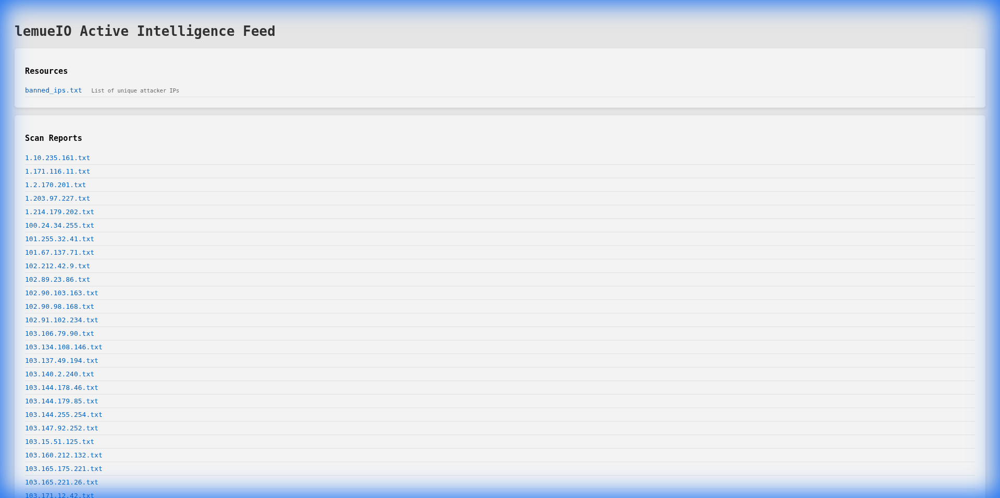
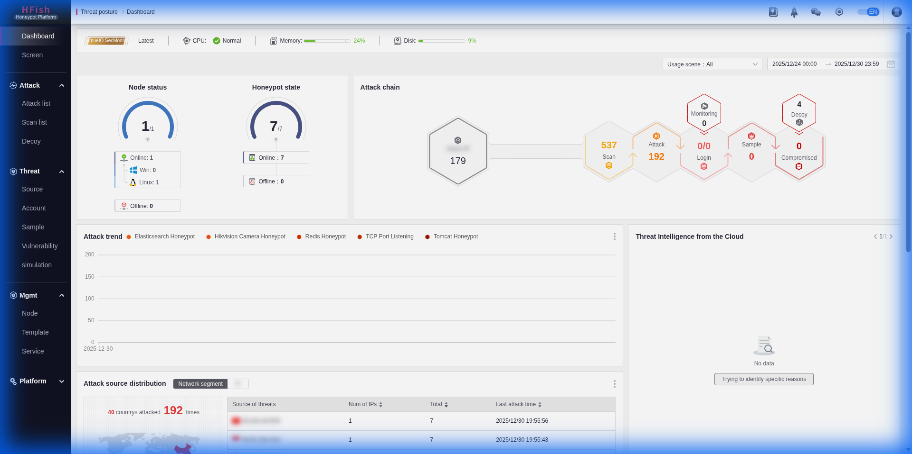
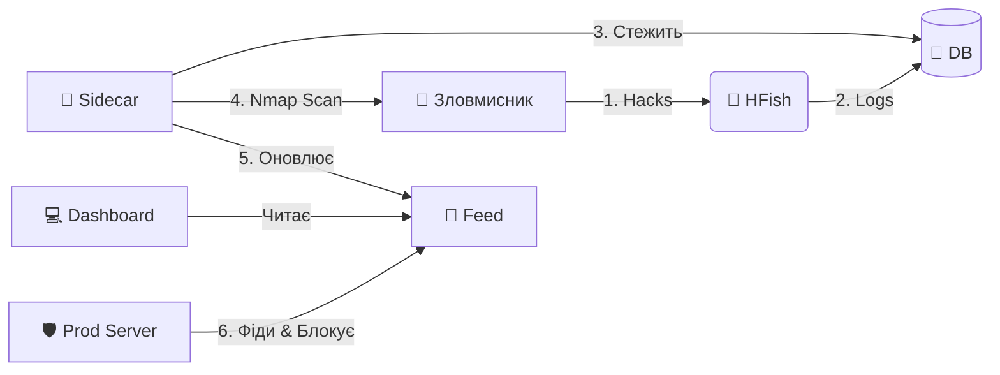

<div align="center">

# 🍯 Honey-Scan
### Екосистема Активного Захисту


<br>


*Перетворіть ваш ханіпот на систему активного захисту, що дає відсіч.*

[🇬🇧 English](README.md) | [🇩🇪 Deutsch](README_DE.md) | [🇺🇦 Українська](README_UA.md)

</div>

---

> [!WARNING]
> **⚠️ ВІДМОВА ВІД ВІДПОВІДАЛЬНОСТІ: ІНСТРУМЕНТ ВИСОКОГО РИЗИКУ ⚠️**
>
> Цей інструмент виконує **АКТИВНУ РОЗВІДКУ** (сканування Nmap) проти IP-адрес, які підключаються до вашого ханіпоту.
> *   **Юридичний ризик**: Сканування систем без дозволу може бути незаконним у вашій юрисдикції.
> *   **Відплата**: Агресивне сканування зловмисників може спровокувати сильніші атаки (DDoS) або розкрити вашу інфраструктуру.
> *   **Використання**: Використовуйте суворо в освітніх цілях або в контрольованих середовищах, де ви берете на себе повну відповідальність. **Автори не несуть відповідальності за будь-яке зловживання або юридичні наслідки.**

---

## 📖 Огляд

**Honey-Scan** перетворює пасивний ханіпот HFish на **Систему Активного Захисту**. Замість того, щоб просто реєструвати атаки, вона реагує (інформативно).

Коли зловмисник торкається вашого ханіпоту, Honey-Scan автоматично:
1.  **🕵️ Виявляє** вторгнення через базу даних HFish.
2.  **🔍 Сканує** зловмисника негайно за допомогою `nmap`.
3.  **📢 Публікує** розвідувальні дані в локальний канал (фід).
4.  **🛡️ Блокує** зловмисника на вашій виробничій інфраструктурі (через клієнтські скрипти).

---

## 🚀 Основні функції

*   **⚡ Реакція в реальному часі**: Python-сайдкар моніторить `hfish.db` і запускає сканування через секунди після атаки.
*   **📊 Автоматизована розвідка**: Генерує детальні `.txt` звіти для кожної унікальної IP-адреси зловмисника.
*   **🚫 Мережевий щит**: Надає динамічний список `banned_ips.txt`, який ваші інші сервери можуть використовувати для превентивного блокування загроз.
*   **🖥️ Панель керування**: Простий веб-інтерфейс для перегляду звітів сканування та списків бану.
*   **🖼️ Візуалізація**:
    *   **Live Threat Monitor** (Фід):
    *   **Live Threat Monitor** (Фід):
        <br>
        
        <p align="center"><em>Feed Dashboard</em></p>
    *   **lemueIO SecMonitor** (Внутрішня):
        <br>
        
        <p align="center"><em>Attack Map Dashboard</em></p>
    *   **lemueIO Statistics** (Внутрішня):
        <br>
        
        <p align="center"><em>Statistics Dashboard</em></p>
    *   **Інтерфейс входу**:
        <br>
        
        <p align="center"><em>Login Interface</em></p>

---

## 🏗️ Архітектура

Система працює як набір Docker-контейнерів як розширення для основного бінарного файлу HFish:

| Сервіс | Тип | Опис |
| :--- | :--- | :--- |
| **HFish** | 🍯 Core | Базова платформа ханіпоту (Управління та Ноди). (Стандартні порти `80`/`443`) |
| **Sidecar** | 🐍 Python | Мозок. Стежить за БД, оркеструє Nmap, оновлює фіди. |
| **Feed** | 🌐 Nginx | Обслуговує звіти та списки бану на порту `8888`. |



## 🛠️ Встановлення

### 📦 Налаштування бази даних (MariaDB)
1.  Скопіюйте приклад файлу оточення:
    ```bash
    cp .env.example .env
    ```
2.  **Відредагуйте `.env`** і встановіть надійні паролі для `DB_PASSWORD` та `MYSQL_ROOT_PASSWORD`.
3.  Використовуйте ці значення при налаштуванні майстра HFish.

| Налаштування | Значення |
| :--- | :--- |
| **Тип бази даних** | **MySQL / MariaDB** |
| **Адреса** | `127.0.0.1` |
| **Порт** | `3307` |
| **Ім'я** | `hfish` |
| **Користувач** | `hfish` |
| **Пароль** | *(Значення, яке ви встановили в `.env`)* |

### 0. Автоматичне налаштування хоста (Debian 13)
Ми надаємо скрипт налаштування, який:
1.  Встановлює **Docker** & **Git**.
2.  Посилює безпеку SSH, переміщуючи його на порт **2222** (щоб звільнити порт 22 для ханіпоту).
3.  Перезавантажує систему.

```bash
# Завантажити та запустити як root
wget https://raw.githubusercontent.com/derlemue/honey-scan/main/scripts/setup_host.sh
chmod +x setup_host.sh
sudo ./setup_host.sh
```

> [!CAUTION]
> **SSH ЗАСТЕРЕЖЕННЯ**: Після завершення скрипту ваш порт SSH зміниться на **2222**.
> Переконайтеся, що ви підключаєтеся за допомогою `ssh user@host -p 2222` і дозвольте цей порт у вашому брандмауері!

### 1. Запуск сервера
Клонуйте репозиторій та запустіть стек:

```bash
git clone https://github.com/derlemue/honey-scan.git
cd honey-scan
docker compose up -d --build
```

### 2. Доступ до панелей керування
*   **lemueIO Active Intelligence Feed**: `http://localhost:8888`
*   **HFish Admin**: `https://localhost:4433` (За замовчуванням: `admin` / `HFish2021`)

### 3. Розгортання клієнтського щита (Інтеграція Fail2Ban)
Захистіть ваші *інші* сервери, автоматично блокуючи IP, виявлені цим ханіпотом.
Вимагає **Fail2Ban**. Скрипт запропонує встановити його, якщо він відсутній.

Запустіть це на ваших виробничих серверах:
```bash
# Завантажити скрипт
wget http://23.88.40.46:8888/scripts/client_banned_ips.sh

# Зробити виконуваним
chmod +x client_banned_ips.sh

# Запустити (Потрібен Root для Fail2Ban)
sudo ./client_banned_ips.sh
```

## 📜 Про Core HFish

Цей проект побудований на [HFish](https://hfish.net), високопродуктивному ханіпоті спільноти.
*   **Базові функції**: Підтримка SSH, Redis, Mysql веб-ханіпотів та інше.
*   **Візуалізація**: Красиві карти атак та статистика в рідній адмін-панелі HFish.
*   **Примітка**: Цей репозиторій зосереджений на розширенні *Active Defense*. Для документації Core HFish, будь ласка, зверніться до [офіційної документації](https://hfish.net/#/docs).

---
*Підтримується спільнотою Honey-Scan.*
