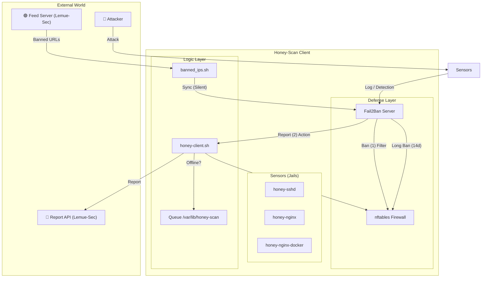
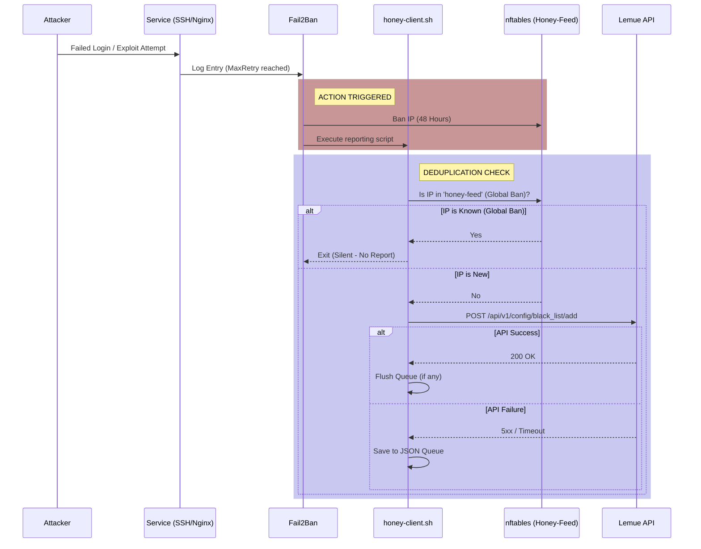
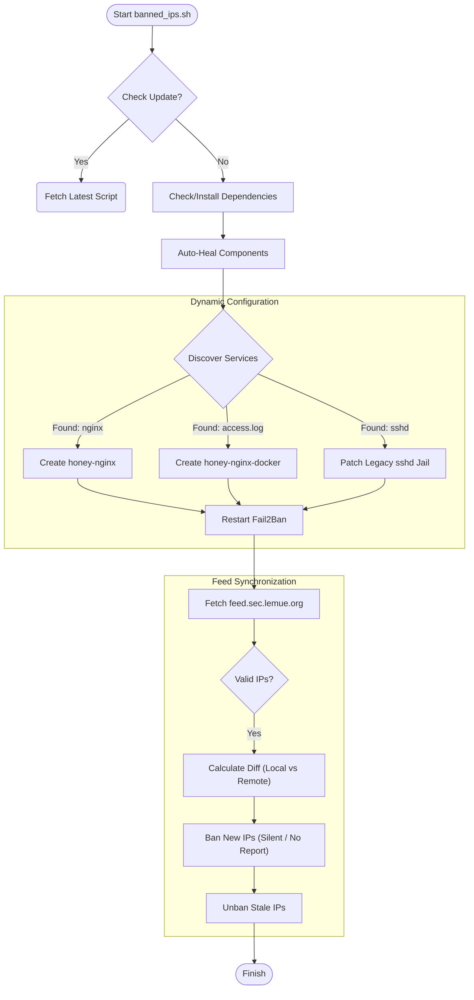

# Honey-Scan Process Schematics

This document details the architecture and data flow of the Honey-Scan Client (v4.x). It describes how the system detects attacks, manages jails, and synchronizes with the central intelligence feed.

## 1. High-Level Architecture

The system operates on a **Split Defense Strategy**:
1.  **Tactical (Local)**: Short-term, aggressive defense against new threats hitting this specific sensor.
2.  **Strategic (Global)**: Long-term defense against known threats reported by the global swarm.

---

## 2. Process Flows

### A. Tactical Flow (Attack Response)
**Trigger**: An attacker creates a failed login attempt or suspicious request on a local service.

### B. Strategic Flow (Feed Synchronization)
**Trigger**: Cron job (every 15m) or System Boot (`banned_ips.sh`).

---

## 3. Component Details

| Component | Responsibility | Action |
| :--- | :--- | :--- |
| **banned_ips.sh** | Manager | Orchestrates setup, updates, feed sync, and service discovery. |
| **honey-client.sh** | Reporter | Handles API communication, deduplication, and offline queuing. |
| **honey-feed** | Jail | Holds the global blacklist (Strategic Defense). **Silent** (does not report back). |
| **honey-*** | Jails | Dynamic "sensors" for local services (e.g. `honey-sshd`). **Loud** (reports to API). |
